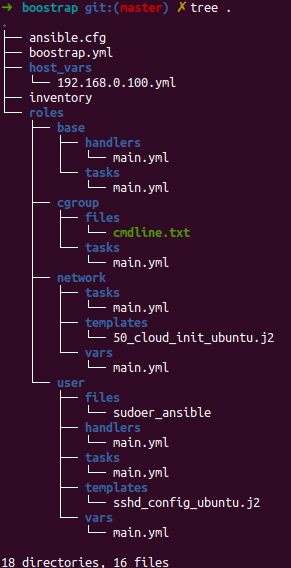
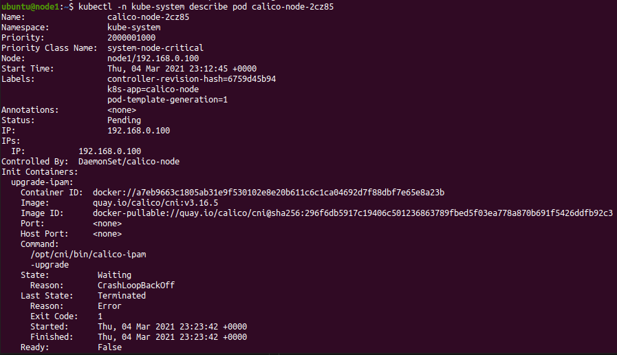

## Introduction
If you want to learn kubernetes have your own cluster is really helpful but be able to break it and experiment with it is an important part of the learning process of those greedy details that are difficult to learn, but if you use a lot of time made the necessary changes to create your clusters you don't want to break it.

Ansible made easy do this process at scale and you can bootstrap as many servers as you want so, In this tutorial we will use Ansible to make all the changes needed in a Raspberrypi to create a kubernetes cluster. You can find the source code [here](https://github.com/AdrianVarelaG/k8s-ansible-raspberrypi).

## Prerequisite

This is not a [Ansible](https://www.ansible.com/) tutorial so preview knowledge is required, if you need to lear basic ansible, I personal recommend [Getting started with Ansible](https://www.youtube.com/watch?v=3RiVKs8GHYQ&list=PLT98CRl2KxKEUHie1m24-wkyHpEsa4Y70) from [LearnLinuxTV](https://www.youtube.com/channel/UCxQKHvKbmSzGMvUrVtJYnUA) YouTube channel.

Previews knowledge of kubernetes is required we do not explain kubernetes architecture or kubectl CLI usage. 

You need at least one Raspberry Pi with Ubuntu 20.04 installed we will follow the instructions of [Install kubernetes on raspberry pi 4 (ubuntu 20.4) by kubespray](https://www.youtube.com/watch?v=8fYtvRazzpo) you can find the commands in this [file](https://github.com/netdevopsx/youtube/blob/master/kubernetes_raspberrypi.txt)

## SSH connection
Ansible requires SSH connection so first we need to configure the connection to be able to use ansible. Let's create the SSH keys we will use the type `ed25519` and then indicates when to store the keys this case `/home/varela/.ssh/ansible` we will not add a passphrase.
```
ssh-keygen -t ed25519 -C "ansible" 
Generating public/private ed25519 key pair.
Enter file in which to save the key (/home/varela/.ssh/id_ed25519): /home/varela/.ssh/ansible              
Enter passphrase (empty for no passphrase): 
Enter same passphrase again: 
Your identification has been saved in /home/varela/.ssh/ansible
Your public key has been saved in /home/varela/.ssh/ansible.pub
```
Now is time to review what is the IP of your raspberry in my case is `192.168.0.100` so we will connect using `ubuntu` as user name `ssh ubuntu@192.168.0.100` the default password is `ubuntu` and ask you for change, so change the password.

It is time to copy the public ssh key, this is the last command that we need to execute manually, let's leave ansible manage the rest of the changes `ssh-copy-id -i ~/.ssh/ansible.pub ubuntu@192.168.0.100` 

## Ansible

first lets review the project structure, as you can see in the image below we are using ansible roles and try to keep organize the project.



### Inventory
In the `inventory` we define the servers in this case we will use a basic [inventory](https://docs.ansible.com/ansible/latest/user_guide/intro_inventory.html#id5) file with one group and the IP of our Raspberry PI 
```
[k8s_cluster]
192.168.0.100
```
### Ansible Configuration
In the `ansible.cfg` file we include the configuration for our ansible playbook, you can find more information about ansible configuration [here](https://docs.ansible.com/ansible/latest/reference_appendices/config.html#ansible-configuration-settings-locations). 
```
[defaults]
inventory = inventory
private_key_file = ~/.ssh/ansible
remote_user = ubuntu
```
* **`inventory = inventory`** indicates to take the local inventory file
* **`private_key_file = ~/.ssh/ansible`** indicates which of the private key to use.
* **`remote_user = ubuntu`** indicates the user.

### Playbook
Now is time to review the main file `boostrap.yml` this file is the playbook and include all the plays.

In the first play we use the `apt module`
```yaml
- hosts: all
  become: true
  pre_tasks:
  - name: install updates
    tags: always
    apt:
      upgrade: dist
      update_cache: yes
```
In the second one we are using the roles and indicates the execution order; base, user, network, cgroup.
```yml
- hosts: all
  become: true
  roles:
    - base
    - user
    - network
    - cgroup
``` 

#### base role
There is not much to say of this role, the main task is define in `roles/base/tasks/main.yaml` file and what does is very simple, ensure the packages are installed and updated in this case `pip` and `git`.
```yaml
- name: install dependencies 
  package:
    name:
      - python3-pip 
      - git
    state: latest
```
In the `roles/base/handlers/main.yaml` file you can find a task for reboot this task is a [handler](https://docs.ansible.com/ansible/latest/user_guide/playbooks_handlers.html) and will not be execute as part of the base role is only the definition but is a common handler so I decide define it in the base role, you can define the handler in the first role that used it.
```yml
- name: reboot_machine
  reboot:
```

#### user role
This role is the responsible of all the tasks related to the user that we use in `kubespray` time to review each task:

In this first task we create a user using [ansible variables](https://docs.ansible.com/ansible/latest/user_guide/playbooks_variables.html) in this case the variables are define in `roles/bases/user/vars/main.yml` in this case the template **"{{ user }}"** is replace with **ansible**.
```yml
- name: create Ansible user
  tags: always
  user:
    name: "{{ user }}"
    group: root
```
The next task is for copy the ssh public key to the `ansible` user.
```yml
- name: add ssh key for ansible
  tags: always
  authorized_key:
    user: "{{ user }}"
    key: "ssh-ed25519 AAAAC3NzaC1lZDI1NTE5AAAAIKqvCSwtFSAaDZoh2ys1C34qIzkFWqQd6dRJkyzn9ZrC ansible"
``` 
The next task is for ensure the user `ansible` can use `sudo` command with out the need of a password, in this case we are using the module copy and indicates to take the file from `roles/bases/user/files/sudoer_ansible`
```yml
- name: Add sudoers file for ansible
  tags: always 
  copy: 
    src: sudoer_ansible
    dest: /etc/sudoers.d/ansible
    owner: root
    group: root
    mode: 0440
```
The last task is for configure the `sshd service` to only allow the users `ubuntu` and `ansible` to connect over ssh in this case we will use two ansible functionalities [templating](https://docs.ansible.com/ansible/latest/user_guide/playbooks_templating.html) and [handlers](https://docs.ansible.com/ansible/latest/user_guide/playbooks_handlers.html).

For the template we have the name of the template in a variable `ssh_template_file: sshd_config_ubuntu.j2` the main difference at less for this example is in the templates allows you to access variables, if you review the file `roles/user/templates/sshd_config_ubuntu.j2` you can see the line `AllowUsers {{ ssh_users }}` this will be replaced with the variable's value `ssh_users: "ubuntu ansible"`.

The second functionality is to notify the handler with the line `notify: restart_sshd`. Ansible uses handlers to address this use case. Handlers are tasks that only run when notified. Each handler should have a globally unique name. You can find the task in `roles/user/handlers/main.yml` as there name indicates restart the sshd service.
```yml
- name: generate sshd_config file from template
  tags: ssh
  template:
    src: "{{ ssh_template_file }}"
    dest: /etc/ssh/sshd_config
    owner: root
    group: root
    mode: 0644
  notify: restart_sshd
``` 
#### network role
The network role as there name's indicates is the responsible for the network changes:

The first task is for allow the IPv4 forwarding this is one of the requirements of [kubespray](https://kubernetes.io/docs/setup/production-environment/tools/kubespray/). The task is using the module [replace](https://docs.ansible.com/ansible/latest/collections/ansible/builtin/replace_module.html) allow you to replace a regular expression in a file.
```yml
- name: Enable IPv4 forwarding
  tags: network
  replace:
    path: /etc/sysctl.conf
    regexp: "#net.ipv4.ip_forward=1"
    replace: "net.ipv4.ip_forward=1"
  notify: reboot_machine
```
The second task is for change the network configuration, this configuration is very specifics, in this case is using the ethernet port and assign a static ip address. In the `roles/network/templates/50_cloud_init_ubuntu.j2` file you can review the configuration, we are using two variables `{{ mac_address }}` and `{{ ip_address }}` this variables are define as host variables this means that change on each host please review the values in `host_vars/example_192.168.0.100.yml` but the name of the file needs to be the IP or the DNS name in this case should be `host_vars/192.168.0.100.yml`.
```yml
- name: configure network from template
  tags: network
  template:
    src: "{{ net_template_file }}"
    dest: /etc/netplan/50-cloud-init.yaml
    owner: root
    group: root
    mode: 0644
  notify: reboot_machine
```
#### cgroup role
This role is the responsible to enable the __cgroup memory__ to do this we need to change the parameters send it to the kernel you can review the documentation [here](https://www.raspberrypi.org/documentation/configuration/cmdline-txt.md). To enable the cgroup we need to add at the end of the file `cgroup_enable=cpuset cgroup_enable=memory cgroup_memory=1` but I decide to copy the full file.
```yml
- name: Enable Cgroup memory 
  tags: always 
  copy: 
    src: cmdline.txt
    dest: /boot/firmware/cmdline.txt
    owner: root
    group: root
    mode: 0440
  notify: reboot_machine
```
### Usage
Is time to use the playbook this part is very simple you should only run `ansible-playbook boostrap.yml` this will end in the raspberrypi ready to install kubernetes using kubespray.

## Kubespray
Is time to use kubespray to install our one node kubernetes cluster. The first part is clone the repository and go to the last release in my case `v2.15.0`.
```shell
git clone https://github.com/kubernetes-sigs/kubespray.git
cd kubespray
git checkout v2.15.0
```
Now is time create the cluster using ansible. This instruction are parte of the official documentation
```shell
# Install dependencies from ``requirements.txt``
pip3 install -r requirements.txt

# Copy ``inventory/sample`` as ``inventory/mycluster``
cp -rfp inventory/sample inventory/mycluster

# Update Ansible inventory file with inventory builder
declare -a IPS=(192.168.0.100)
CONFIG_FILE=inventory/mycluster/hosts.yaml python3 contrib/inventory_builder/inventory.py ${IPS[@]}

# Review and change parameters under ``inventory/mycluster/group_vars``
cat inventory/mycluster/group_vars/all/all.yml
cat inventory/mycluster/group_vars/k8s-cluster/k8s-cluster.yml
```
Before execute the playbook we need to change `inventory/mycluster/host.yaml` to include the user that ansible will use to connect. So include the property `ansible_user: ansible`, this is another way to define a inventory file and you can review how the cluster will be created.
```yaml
all:
  hosts:
    node1:
      ansible_host: 192.168.0.100
      ansible_user: ansible
      ip: 192.168.0.100
      access_ip: 192.168.0.100
  children:
    kube-master:
      hosts:
        node1:
    kube-node:
      hosts:
        node1:
    etcd:
      hosts:
        node1:
    k8s-cluster:
      children:
        kube-master:
        kube-node:
    calico-rr:
      hosts: {}
```
Time to run the playbook, this will take a while so take a break.
```shell
# Deploy Kubespray with Ansible Playbook - run the playbook as root
# The option `--become` is required, as for example writing SSL keys in /etc/,
# installing packages and interacting with various systemd daemons.
# Without --become the playbook will fail to run!
ansible-playbook -i inventory/mycluster/hosts.yaml  --become --become-user=root cluster.yml
```
## Kubernetes
At this point the cluster is create so we need to connect to be able to use it. Connect by ssh you can use the ubuntu or the ansible user, and then copy the **.kube/config** file.
```
ssh ubuntu@192.168.0.100
sudo cp /root/.kube/config .kube/config
```
With this you can test the connection with `kubectl cluster-info` or `kubectl version`.
### The problem
Ones the cluster is running, I decide to review the `kube-system` namespace. 


After some time reviewing the problem and review logs of the `kubelet`, `events` and a lot of others, I decide to review the pod. As you can view the problems is in the init container `upgrade-ipam`.


With this information we should review the log of the container, this log show the problem and after a fast search in google I found an [issue](https://github.com/projectcalico/calico/issues/4256) with the images and the arm64 architecture. 
```
ubuntu@node1:~$ kubectl -n kube-system logs calico-node-2cz85  -c upgrade-ipam
standard_init_linux.go:211: exec user process caused "exec format error"
```
### The Fix
To fix this problems as the issue indicates we can use the docker registry images so we need to edit the `deamonset` and change the registry from `quay.io` to `docker.io` we use this command to made the changes `kubectl -n kube-system edit daemonset.apps/calico-node`.

After a few seconds we can review the pods. As you can see the calico-node pod is running, but the calico-kube-controllers pod not, the problem is the same so time to edit the deployment `kubectl -n kube-system edit deployment/calico-kube-controllers` 

```shell
ubuntu@node1:~$ kubectl -n kube-system get all
NAME                                          READY   STATUS    RESTARTS   AGE
pod/calico-kube-controllers-8b5ff5d58-m2dxs   0/1     Error     5          20m
pod/calico-node-cj82l                         1/1     Running   0          49s
pod/coredns-85967d65-p2jjn                    0/1     Pending   0          9s
pod/coredns-85967d65-pq4f5                    0/1     Running   0          19m
pod/dns-autoscaler-7f4845f945-wq8td           1/1     Running   0          18m
pod/kube-apiserver-node1                      1/1     Running   0          22m
pod/kube-controller-manager-node1             1/1     Running   0          22m
pod/kube-proxy-99r5k                          1/1     Running   0          21m
pod/kube-scheduler-node1                      1/1     Running   0          22m
pod/nodelocaldns-tsdhc                        1/1     Running   0          18m

```
After a few seconds the only pod with problems is one of the coredns, to be able to run this pod is necessary to have at least a 2 nodes kubernetes cluster.
```shell
ubuntu@node1:~$ kubectl -n kube-system get all
NAME                                          READY   STATUS    RESTARTS   AGE
pod/calico-kube-controllers-5d4957bfd-c585v   1/1     Running   0          26s
pod/calico-node-cj82l                         1/1     Running   0          5m37s
pod/coredns-85967d65-p2jjn                    0/1     Pending   0          4m57s
pod/coredns-85967d65-pq4f5                    1/1     Running   0          23m
pod/dns-autoscaler-7f4845f945-wq8td           1/1     Running   0          23m
pod/kube-apiserver-node1                      1/1     Running   0          27m
pod/kube-controller-manager-node1             1/1     Running   0          27m
pod/kube-proxy-99r5k                          1/1     Running   0          26m
pod/kube-scheduler-node1                      1/1     Running   0          27m
pod/nodelocaldns-tsdhc                        1/1     Running   0          23m
``` 
## Conclusion
Use Ansible to automatic initialize the raspberrypis is very useful and allow you not making the same configuration over and over again, a small project like this helps a lot to explore Ansible and had a better understanding of this tool.

Ones you know how Ansible works use kubespray is a logical path if you want to install a kubernetes cluster, you can review a comparison with other tools [here](https://kubespray.io/#/docs/comparisons). If you want to test different network plugins destroy and create clusters with kubespray is a easy way to do it. 

Have a full kubernetes cluster in a raspberrypi is not necessary the best way to run it, you can use other tools like `k3s` or `microk8s` are lightweight and are easy to bootstrap. 