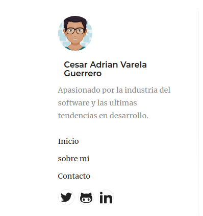

En este primer post voy a hablar de la manera que cree mi sitio personal y la motivación que me llevo a hacerlo.
##Stack de tecnología
Para este proyecto lo que estoy usando es [gatsby](https://www.gatsbyjs.org/) en caso de que no estés familiarizado con esta tecnología es un framework para crear paginas y aplicaciones web de manera muy rápida, me gusta esta tecnología ya que usa [React](https://reactjs.org/) y Grapql para su desarrollo.
##Motivación
Para mí la principal motivación de crear mi sitio personal es llevar un registro de lo que estudio y aprendo ya que muchas veces me encuentro buscando la misma información que en algún momento ya había buscado y el tener ese registro me va a ahorrar mucho tiempo.
Ahora bien al ser un developer tener un portafolio es más importante que nunca ya que el tener un titulo de una universidad ya no es importante para conseguir un trabajo en lugares como _Google_ o _Amazon_ es más importante que puedas resolver problemas y el conocimiento técnico que tienes ya no importa si este conocimiento lo adquiriste por medio de internet o una universidad.

##Pasos a seguir
Para indicar los pasos que seguí para podre crear mi sitio tengo que aclarar que ya contaba con conocimientos previos tanto de _React_ como de _Graphql_ adicional eso tengo que indicar que siempre primero recurro a _Youtube_ cuando quiero aprender algo nuevo en este caso hice lo mismo pero al ver que la mayoría de los videos eran antiguos 1 o 2 años decidí ir a la documentación oficial.
1. Seguir los tutoriales de _gatsby_ en la pagina oficial [Tutorial Gatsby](https://www.gatsbyjs.org/tutorial/)
2. Revisar los [gatsby starters](https://www.gatsbyjs.org/starters/?v=2) algunos de ellos están muy completos y tienen mucha funcionalidad si lo que buscas es crear un sitio rápido vale la pena revisarlos. En mi caso me gusto el menú el de la izquierda de [gatsby-starter-lumen](https://www.gatsbyjs.org/starters/alxshelepenok/gatsby-starter-lumen/) el detalle fue que no entendía como se estaban seleccionando los diferentes templates con lo que cuenta, adicional a esto utilizaba demasiadas librerías para mi gusto, por lo cual decidí utilizar un starter que entendía perfectamente [gatsby-starter-blog](https://www.gatsbyjs.org/starters/gatsbyjs/gatsby-starter-blog/) y re estructurarlo para que se viera como el que me había gustado esto me lleva al siguiente punto.

3. Para poder pasar el menú de un proyecto a otro tuve que agregar el pluging de _SASS_ y aprender un poco de [_SASS_](https://www.youtube.com/watch?v=St5B7hnMLjg&list=PL4cUxeGkcC9iEwigam3gTjU_7IA3W2WZA) para esto tome un tutorial rápido solo de algunos conceptos que no entendía en este caso me apoye en _Youtube_ algunas de las personas que sigo en esta plataforma seria [The Net Ninja](https://www.youtube.com/channel/UCW5YeuERMmlnqo4oq8vwUpg), adicional a esto copie algunos estilos de _SASS_ y al no usar la librería de _LostGrid_ tuve que agregar algo de _css_ en los media queries.  
4. Aun que aun no he terminado con el estilo de mi sitio decidí ponerlo en linea al revisar las opciones que _Gatsby_ te da para hacer el [Deploy](https://www.gatsbyjs.org/docs/deploying-and-hosting/) unas de las mas sencillas es usar [_Netlify_](https://www.netlify.com/) ya que se integra directamente con _Github_ y es muy cómodo para mi solo hacer una actualización al repositorio y de manera automática queda desplegado.
