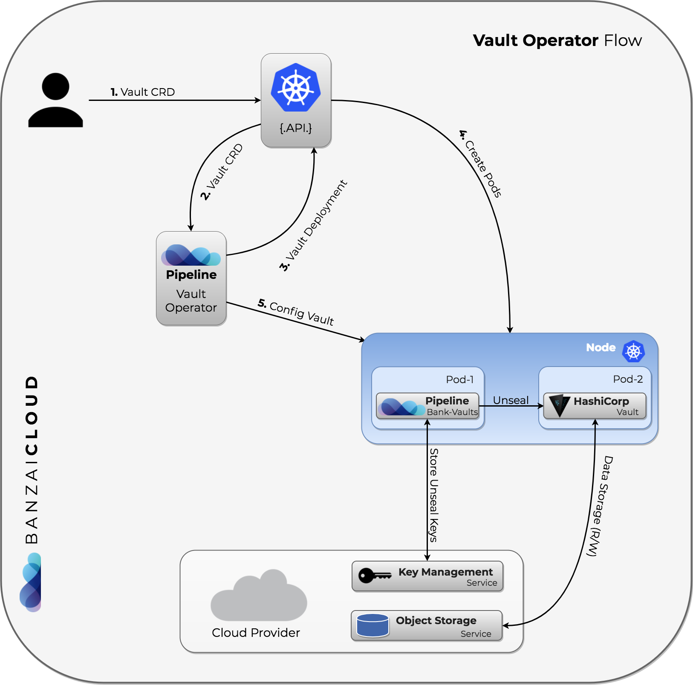

## Motivación
Es muy sencillo instalar jenkins-x en google cloud y funciona muy bien pero por lo que veo me seria mas costoso aun que sigo en la versión de prueba con créditos gratuitos dejar un cluster corriendo por un día consume gran parte de los créditos al pensar en dejar el cluster funcionando de manera indefinida seria muy costoso para mi en este momento por lo que decidí instalarlo en [Digital Ocean](https://m.do.co/c/3ae012361d17) (El link es el de mi codigo de referencia)

esto blog es para documentar el avance.

## Instalación

### Creación del cluster 
Aun que debería usar algo como Terraform para crear mi cluster de momento lo haré desde la consola en un futuro cambiare esto.

para esto seleccione la versión 1.16 (Es importante) ya veran por que.

### Antes de instalar
Como sugerencia en un video de la instalación de jexnkins-x sugieren usar una organización para hacer la instalación por lo que me pareció una buena idea de hacer y crear una cuenta para para usarla como un bot en la instalación y así todas las tarea que realiza jenkins-x por ti queden registrado con ese usuario.

### Cambiar la configuración
Para esto seguí los pasos que indicaban en esta guía [changing-your-installation](https://jenkins-x.io/docs/getting-started/setup/boot/#changing-your-installation) no es mucho problema hace un fork a un repositorio y modificar el archivo __jx-requirement.yaml__ en este punto debí dar un commit para dejar registro de la forma inicial del archivo pero no lo hice así que hagamos un recuento de que cambie para no olvidarlo.
 * clusterName: lo cambie por el nombre de mi cluster en DO
 * environmentGitOwner: Nombre de mi organización en GitHub
 * environmentGitPublic: lo cambie a true 
 * provider: lo cambie por "kubernetes" de acuerdo a la documentacion que es un poco confusa.
 * secretStorage: lo cambie por "vault" ya que debería ser un ambiente para colaborar aun que solo lo use yo en este momento.

hecho esto ejecute `jx boot` después de contestar algunas cosas que te pregunta la interface como que solo tenemos soporte para GKE y EKS que si quieres continuar y que los hooks se van a hacer sobre http y debería ser https nos encontramos con el primer problema

> no matches for kind "Deployment" in version "apps/v1beta2" 

bueno tras investigar un poco encontre el Chart template que se usa para crear los recursos de vault. [Vault Operator](https://github.com/jenkins-x-charts/vault-operator/blob/master/vault-operator/templates/deployment.yaml)

lo cual me hizo sospechar del apiVersion y de compatibilidad de versiones y en efecto en la [version 1.16 apps/v1beta2 fue deprecada para los Deployments](https://kubernetes.io/blog/2019/07/18/api-deprecations-in-1-16/).

Al apenas estar aprendiendo de jenkins-x y Golang no tengo la confianza como para generar mi propio fork y usar un chart diferente así que la opción que tome cambiar la versión de mi cluster en DO cambie el cluster a la version 1.15 (al decir cambiar me refiero a eliminar el cluster y volver a generarlo).

Así que intento numero 2 `jx boot` en este punto me marco otro error segun el codigo tu no puedes usar vault en jenkins x si tu cloud provider no es Google o Amazon, me puse a investigar un poco mas y en el codigo leen un config map `jx-install-config` y existe una validacion para el key `kubeProvider` solamente es valido con `gke`, `eks(aws)` tengo que investigar mas al respecto para ver como podemos usar vault y revisando las imagenes que se instalan me encontre este projecto [banzaicloud](https://github.com/banzaicloud/bank-vaults) que es lo que se usa en jenkins-x. Utilizan el vault operator No soy ningun experto en vault asi que me puse a investigar un poco de como funciona.

> Once started, the Vault is in a sealed state. Before any operation can be performed on the Vault it must be unsealed. This is done by providing the unseal keys. When the Vault is initialized it generates an encryption key which is used to protect all the data. That key is protected by a master key. By default, Vault uses a technique known as [Shamir's secret sharing algorithm](https://en.wikipedia.org/wiki/Shamir's_Secret_Sharing) to split the master key into 5 shares, any 3 of which are required to reconstruct the master key.

Para simplificarlo se crea el pod de vault en un estado de "sealed" y para poder usarlo tienes que que hacer una operación de "unsealed" enconces se construye una "master key" y se divide en 5 "shared key" y estas se tratan de almacenar en el cloud provider DO no tiene __KMS (Key Management Service)__ por lo cual no se pueden almacenar las "shared keys".

En resumen en este punto decidí cambiar la configuración a usar local en lugar de vault 
* **secretStorage**: se cambia a local 

sin envargo esto lleva a otro problema es que siempre hay que correr `jx boot` desde tu computadora local.

### Local como secret Storage
Lo que hice fue borrar el cluster y crearlo nuevamente para iniciar la instalación de nuevo, por cierto también volví a la version `1.16.1` esperemos que no tenga que volver a empezar por este motivo.

Pues no debi cambiar a la version 1.16 regreso el error.
> no matches for kind "Deployment" in version "extensions/v1beta1". 

Por lo tanto vamos de nuevo versión 1.15, El siguiente problema fue una vez que la instalación estaba lista pero los pods no se estaban colocando como ready, para esto use un comando para ver los eventos en el cluster `kubectl event` el problema fue los doplets que seleccione al querer un cluster de bajo costo me fui por  dos doplets de 15 Usd con 1 CPU y 3GB RAM al estarse creando los componentes el `sheduler controller` simplemente no encontró donde poner todos los componentes al hacer falta CPU. Así que toco borrar el cluster y generar 1 nuevo con diferentes doplets es esta ocasión fueron 2 nodos de 20 usd con 2 cpu y 4 GB de ram.

bueno este fue el ultimo error una vez que corri nuevamente `jx boot` la instalación funciono sin problemas. 

Como principal pendientes que es un **deal breaker** es el uso de tls aun sin poder usar vault pero usando tls esta herramienta se puede utilizar bien en Digital Ocean almenos a una escala pequeña.  
