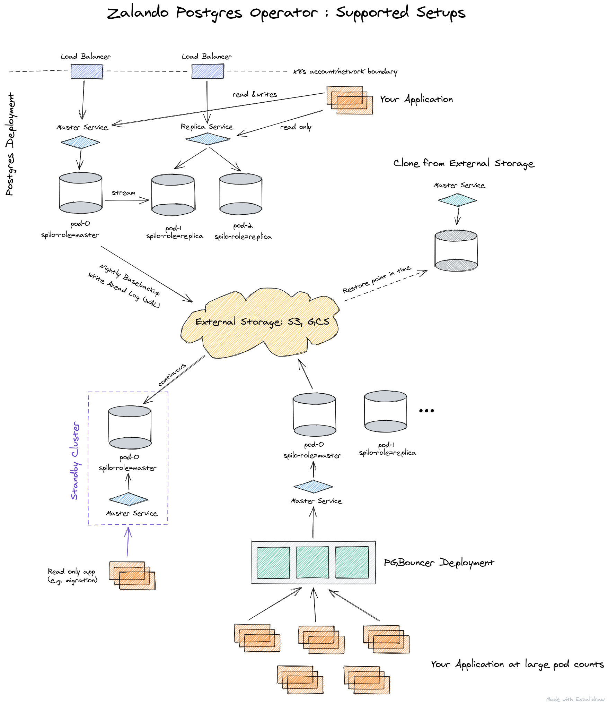
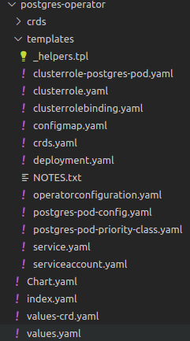
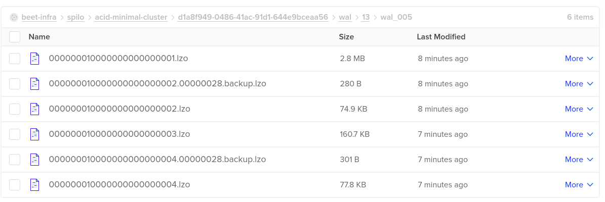

## Introduction
As introduction I have to say that if you want to manage many databases, a convenient way to do it is using an operator, this way the operator manage the databases. Today we will install zalando postgres operator and we will create a cluster with WAL files and base backups.  

The Postgres Operator official definition is:
>The Postgres Operator delivers an easy to run highly-available [PostgreSQL](https://www.postgresql.org/) clusters on Kubernetes (K8s) powered by [Patroni](https://github.com/zalando/spilo). It is configured only through Postgres manifests (CRDs) to ease integration into automated CI/CD pipelines with no access to Kubernetes API directly, promoting infrastructure as code vs manual operations.

### Operator features 
* Rolling updates on Postgres cluster changes, incl. quick minor version updates
* Database connection pooler with PGBouncer
* Restore and cloning Postgres clusters (incl. major version upgrade)
* Additionally logical backups to S3 bucket can be configured
* Standby cluster from S3 WAL archive

### What we get

Once the operator is installed, you can easily setup a databases according to the image below. 



## Prerequisite
As prerequisite we need:
* Kubernetes cluster (in my case I will use a Digital Ocean)
* *S3* compatible service (in my case Digital Ocean spaces)
* *S3* bucket pre configured

### My special setup
In my case I am using [terraform](https://www.terraform.io/) to create the bucket, so it was really easy to include the resource in the definition.

```terraform
resource "digitalocean_spaces_bucket" "beet-infra" {
  name    = "beet-infra"
  region  = var.do_region
  acl     = "private"
}
```
I am also using [sealed-secrets](https://github.com/bitnami-labs/sealed-secrets), this allow me to include my secretes in the repository. I am also using terraform to install this component.
```terraform
resource "helm_release" "sealed-secrets" {
  name        = "sealed-secrets"
  repository  = "https://bitnami-labs.github.io/sealed-secrets"
  chart       = "sealed-secrets"
  version     = "1.13.2"
  namespace   = "kube-system"
}
```
time to start.
## Initial setup
First we need to create a namespace, you can use `kubectl` in my case terraform
```
resource "kubernetes_namespace" "postgres-operator" {
  metadata {
    name = "postgres-operator"
  }
}
```
Now is time to clone the repository.
```bash
git clone https://github.com/zalando/postgres-operator.git
cd postgres-operator
```
We will use helm and the CRD installation so is time to review the changes in the file `./charts/postgres-operator/values-crd.yaml`

```yaml
configKubernetes:
  # namespaced name of the ConfigMap with environment variables to populate on every pod
  pod_environment_configmap: "postgres-operator/postgres-pod-config"
  # name of the Secret (in cluster namespace) with environment variables to populate on every pod
  pod_environment_secret: "postgres-operator"
# configure interaction with non-Kubernetes objects from AWS or GCP
configAwsOrGcp:
  # AWS region used to store ESB volumes
  aws_region: ny3
  # S3 bucket to use for shipping WAL segments with WAL-E
  wal_s3_bucket: "beet-infra"
```
Les's review the changes 
* **pod_environment_configmap: "postgres-operator/postgres-pod-config"** this is a config map that injects on each pod the values of the config map, the format is namespaces/name.
* **pod_environment_secret: "postgres-operator"** this is a secret that needs to be created in the namespace of the postgres cluster.
* **aws_region: ny3** this is the region on DigitalOcean from my space
* **wal_s3_bucket: "beet-infra"** Name of the bucket 

Now let's review the `postgres-pod-config.yaml`. We need to indicate the endpoint for the bucket, also you can inject more configuration reviewing the [spilo env](https://github.com/zalando/spilo/blob/master/ENVIRONMENT.rst) variables. 
```yaml
apiVersion: v1
kind: ConfigMap
metadata:
  name: postgres-pod-config
data:
  AWS_ENDPOINT: https://nyc3.digitaloceanspaces.com
```
We need to include two Environment variables more but this should be secrets. The constrain with the secrets is that they need to exist in the same name space from the postgres cluster, so you need to create two environment variables with the value of space access and secret key.
```bash
export ACCESS_KEY=......
export SECRET_KEY=......
```
As I mention before, I am using sealed secret, so let's create it. I forgot to mention but sealed secret has a CLI `kubeseal`, with the command below we can create a secret using `kubectl`, then pipe the output to `kubeseal` and create a file with the output.
```bash
kubectl --namespace default \
    create secret \
    generic postgres-operator \
    --dry-run=client \
    --from-literal AWS_ACCESS_KEY_ID=$ACCESS_KEY \
    --from-literal AWS_SECRET_ACCESS_KEY=$SECRET_KEY \
    --output yaml \
    | kubeseal --controller-name sealed-secrets -o yaml\
    | tee postgres-operator-secret.yaml
```
The sealed secret creates the secret with the same name
```yaml
apiVersion: bitnami.com/v1alpha1
kind: SealedSecret
metadata:
  creationTimestamp: null
  name: postgres-operator
  namespace: default
spec:
  encryptedData:
    AWS_ACCESS_KEY_ID: ...
    AWS_SECRET_ACCESS_KEY: ...
  template:
    metadata:
      creationTimestamp: null
      name: postgres-operator
      namespace: default
```
## Installation 

For the installation first we need to create the config map in the k8s cluster, but I include the config map in the template folder in the Helm chart, so nothing to apply because Helm will apply it. you can see the `postgres-pod-config.yaml` in the image below.



In this case to install with helm we will use the next command
```bash
helm upgrade --install postgres-operator \ 
  ./postgres-operator \
  -f postgres-operator/values-crd.yaml \ 
  --namespace postgres-operator \
  --wait
```
After a few seconds you can review the pods
```bash
kubectl -n postgres-operator get pods                             
NAME                                 READY   STATUS    RESTARTS   AGE
postgres-operator-694bdb9d54-55qkx   1/1     Running   0          7s
``` 
Now let's use the default namespace, first we need the sealed secret use the command `kubectl apply -f postgres-operator-secret.yaml` this will create the secret. The next step is to apply the file with the database definition, for that let's review it, I am using the `minimal-postgres-manifest.yaml` you can find it in the same repository `manifests/minimal-postgres-manifest.yaml` in this file the only change is in the field `storageClass` in this case the value depends on your cloud provider, for digital ocean the value is `do-block-storage` and with that the persistent volume claim will be created.
```yaml
apiVersion: "acid.zalan.do/v1"
kind: postgresql
metadata:
  name: acid-minimal-cluster
spec:
  teamId: "acid"
  volume:
    size: 1Gi
    storageClass: do-block-storage
  numberOfInstances: 2
  users:
    zalando:  # database owner
    - superuser
    - createdb
    foo_user: []  # role for application foo
  databases:
    foo: zalando  # dbname: owner
  preparedDatabases:
    bar: {}
  postgresql:
    version: "13"
```
After a few seconds we can see the two pods, the service for the master and the service for replica were created.
```bash
kubectl apply -f minimal-postgres-manifest.yaml
kubectl get pods,service
NAME                         READY   STATUS    RESTARTS   AGE
pod/acid-minimal-cluster-0   1/1     Running   0          14m
pod/acid-minimal-cluster-1   1/1     Running   0          14m

NAME                                  TYPE        CLUSTER-IP       EXTERNAL-IP   PORT(S)    AGE
service/acid-minimal-cluster          ClusterIP   10.245.221.78    <none>        5432/TCP   14m
service/acid-minimal-cluster-config   ClusterIP   None             <none>        <none>     14m
service/acid-minimal-cluster-repl     ClusterIP   10.245.161.130   <none>        5432/TCP   14m
service/kubernetes                    ClusterIP   10.245.0.1       <none>        443/TCP    15d
```
In the space in Digital ocean we can review the WAL files.



Now we will connect to the pod and review the configuration for the base backup in the postgres database.
```
kubectl exec -it acid-minimal-cluster-0 -- bash

root@acid-minimal-cluster-0:/home/postgres# su - postgres

postgres@acid-minimal-cluster-0:~$ crontab -l
PATH=/usr/local/sbin:/usr/local/bin:/usr/sbin:/usr/bin:/sbin:/bin:/usr/lib/postgresql/13/bin
0 1 * * * envdir "/run/etc/wal-e.d/env" /scripts/postgres_backup.sh "/home/postgres/pgdata/pgroot/data"

postgres@acid-minimal-cluster-0:~$ psql
psql (13.1 (Ubuntu 13.1-1.pgdg18.04+1))
Type "help" for help.

postgres=# \l
                                  List of databases
   Name    |   Owner   | Encoding |   Collate   |    Ctype    |   Access privileges   
-----------+-----------+----------+-------------+-------------+-----------------------
 bar       | bar_owner | UTF8     | en_US.utf-8 | en_US.utf-8 | 
 foo       | zalando   | UTF8     | en_US.utf-8 | en_US.utf-8 | 
 postgres  | postgres  | UTF8     | en_US.utf-8 | en_US.utf-8 | 
 template0 | postgres  | UTF8     | en_US.utf-8 | en_US.utf-8 | =c/postgres          +
           |           |          |             |             | postgres=CTc/postgres
 template1 | postgres  | UTF8     | en_US.utf-8 | en_US.utf-8 | =c/postgres          +
           |           |          |             |             | postgres=CTc/postgres
(5 rows)

```

## Conclusion
As you can see, the operator is the best way to manage many postgres clusters and can be done in different namespaces. The only disadvantage is the secret needs to be injected on each namespace, but is something that can be automatic. After the operator is configured we get base backups, WAL files and stream replication with no effort. 